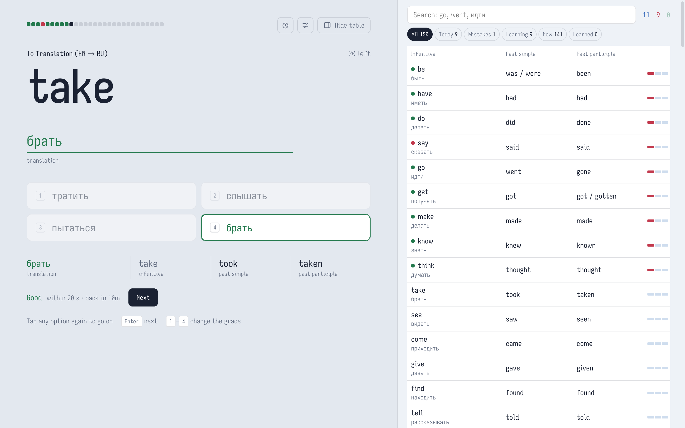
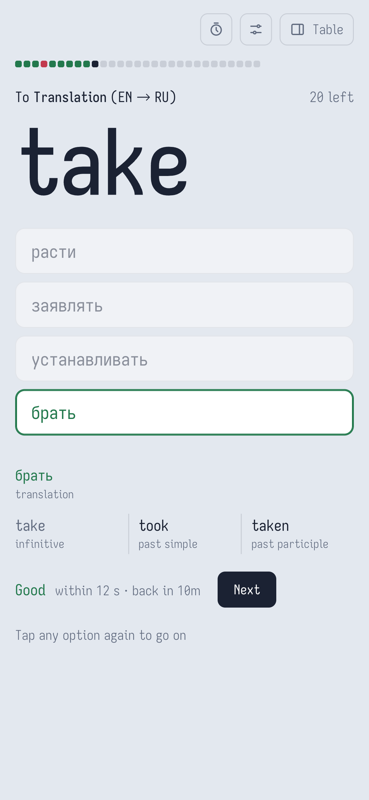

<p align="center">
  
</p>

<h1 align="center">English Verbs</h1>

<p align="center">
  <strong>Type the word. Learn the forms. Let the scheduler bring it back.</strong>
</p>

<p align="center">
  A free trainer for the most common English verbs, with Russian translations.<br />
  Translation both ways, all three forms, Anki-style spaced repetition, and an app that works offline.
</p>

<p align="center">
  <a href="https://bmox0.github.io/EnglishWords/">Open the app</a> ·
  <a href="#how-english-verbs-works">How it works</a> ·
  <a href="#placement-test">Placement test</a> ·
  <a href="#install">Install</a> ·
  <a href="#adding-words">Add words</a>
</p>

<p align="center">
  <a href="https://github.com/bmox0/EnglishWords/actions/workflows/deploy.yml">
    
  </a>
  
  
</p>



## How English Verbs works

### One question at a time

Each question asks one thing: a translation, the infinitive, or one past form. The line above the prompt says what to turn it into, like **To Past Simple (V1 → V2)**. Type the answer, pick one of four options, or do either: the options sit right below the field, so a synonym you typed (видеть for смотреть) is easy to set right.

| What you get              | How English Verbs does it                                            |
| ------------------------- | -------------------------------------------------------------------- |
| **Translation both ways** | EN → RU and RU → EN cards for every verb                             |
| **All three forms**       | A forms card for every verb that asks V2, V3, or back to V1          |
| **Type or pick**          | A field with four options below it; a typo counts as "almost"        |
| **Automatic grades**      | Good, Hard or Again from the answer and the time it took             |
| **Spaced repetition**     | Anki's SM-2 defaults decide when each card comes back                |
| **Verb table**            | Every verb with its forms and progress, with search and filters      |
| **Placement test**        | A whole topic in one run, saved to the history like any other answer |

### Built for daily practice

- The wrong options are easy to mix up with the right one: other forms of the same verb, the `-ed` guess (`goed`), words spelled alike.
- A verb that shares the translation (`make` for делать) gets another try instead of a miss.
- The table hides the verb on the card. You can peek, but then the card gets Again.
- After the daily plan, **Learn 10 more cards** raises today's new-card limit, and **Practice mistakes** drills up to 20 cards you got wrong without changing when they come back.
- Keys on a desktop, taps on a phone: tap an option again to go to the next card. The table becomes a full-screen sheet.
- Light and dark themes.

<p align="center">
  
</p>

<p align="center">
  <em>With Always pick, every answer on a phone is a tap.</em>
</p>

## How cards are scheduled

Cards follow Anki's v3 defaults: learning steps of 1 and 10 minutes, then 1 day (4 days on Easy); ease starts at 250%; a day starts at 4:00. **Settings** controls how many new cards appear per day (20 by default).

- **Automatic grades.** Every answer is graded on its own: Again for a miss, "don't know" or a peek; Hard for a typo or a right answer slower than 12 s when picking (20 s when typing); Good otherwise. Easy is never given automatically. Keys 1–4 change the grade.
- **Unlocking.** A new word starts with EN → RU. RU → EN opens the day after EN → RU is learned, and forms open the day after RU → EN. Opened cards use the daily new-card limit before new words do.
- **Blocks by task.** The day's cards come one task at a time: EN → RU, then RU → EN, then the forms one direction at a time (V1 → V2, V1 → V3, V2 → V1, V3 → V1, RU → V2, RU → V3). A forms card asks one direction a day. A missed card comes back in its own block, and the next block starts once the mistakes are cleared. Practice rounds keep the same order.
- **No siblings back to back.** Cards of the same word never come one right after another.

## Placement test

The stopwatch button opens the test. Choose the skills (EN → RU, RU → EN, V1 → V2, V1 → V3) and how many words each skill takes: all, 100, 50 or 20 from the top of the list. The next question comes right away, without feedback. Questions follow **Settings → Answers**.

The test is not a separate mode: it is a fast way to answer many cards at once. **Save answers** adds every answer to the history, the same as an answer on the card. Each answer gets the automatic grade, the card moves on by the scheduler, and the answer shows up under **Today** in the table. V1 → V2 and V1 → V3 both answer the forms card, which is graded once by the worse of the two. You can stop early and save what you have answered.

## Privacy and data

There is no account, no server and no analytics. Progress lives in your browser's `localStorage` under `english-words:v1`, so each browser and device keeps its own. **Settings → Export / Import** moves it between devices or backs it up.

Progress is stored per card id (`<word id>:<kind>`), so adding, reordering or removing words never loses what you have learned.

The only outside request is the Iosevka Charon font from Google Fonts.

## Install

The app runs in the browser at [bmox0.github.io/EnglishWords](https://bmox0.github.io/EnglishWords/). Install it to open it like an app and to use it offline after the first visit.

| Device       | How to install                                               |
| ------------ | ------------------------------------------------------------ |
| iPhone, iPad | Safari → Share → **Add to Home Screen**                      |
| Android      | Chrome → **Install app**                                     |
| Desktop      | The install icon in the address bar of Chrome, Edge or Brave |

New versions arrive on their own: the app loads from the network when it can and falls back to its cache offline.

<details>
<summary>Progress in the iPhone app</summary>

iOS keeps the installed app's storage apart from Safari. To carry progress over, export it in Safari (**Settings → Export**) and import it in the app (**Settings → Import**).

</details>

## Keys

| Key   | When                                                 |
| ----- | ---------------------------------------------------- |
| Enter | check the answer, then go to the next card           |
| 1–4   | pick an option, or change the grade after the answer |
| Esc   | close the table on a phone                           |
| 0     | "Don't know" in the placement test                   |

An empty typed answer means "don't remember".

## Adding words

Words live in `data/<NN>-<set>.jsonl`, one JSON object per line, for example `data/01-150-verbs.jsonl`. Files load in number order and new words are introduced in that order, so a new set takes the next number (`data/02-phrasal-verbs.jsonl`). The set name doubles as the words' tag.

<!-- prettier-ignore -->
```jsonl
{"id": "verb-get", "pos": "verb", "en": "get", "ru": ["получать"], "v2": ["got"], "v3": ["got", "gotten"], "irregular": true, "tags": ["150-verbs"], "hint": "разг.: доставать, добывать"}
```

| Field       | Required | Notes                                                                                                        |
| ----------- | -------- | ------------------------------------------------------------------------------------------------------------ |
| `id`        | yes      | `<pos>-<word>` in lowercase. Progress is attached to it, so it never changes once studied.                   |
| `pos`       | yes      | Part of speech: `verb`, `noun`, `adjective`, …                                                               |
| `en`        | yes      | The English word; the infinitive (without "to") for verbs.                                                   |
| `ru`        | yes      | Translations. Any of them is accepted as an answer, so list the common ones.                                 |
| `v2`, `v3`  | verbs    | Past simple and past participle; every accepted variant goes in the list (`["was", "were"]`).                |
| `irregular` | no       | `true` when a form is not built with -ed, -d, -ied or a doubled consonant. The table dims the regular forms. |
| `hint`      | twins    | Required for words that share a Russian translation (`do` / `make`), shown next to the Russian prompt.       |
| `tags`      | yes      | Labels for the set; may be empty.                                                                            |

Words without `v2`/`v3` (nouns, adjectives) get only the two translation cards.

**From a spreadsheet:** `pnpm words:import words.xlsx --tag <set>` prints new lines. The first row must name the columns (`v1`/`en`, `перевод`/`ru`, `v2`, `v3`, optional `hint`). Words already in the deck are skipped, and words that need a hint are listed.

**With Claude Code:** the project skill `.claude/skills/add-words` handles the steps: drafting entries, hints for twins, validation, review and publishing. Ask for example "add these verbs: swim, fly, forgive".

`pnpm words:check` validates the data: JSON, required fields, id format, repeated words, hints for twins. The deploy runs it too, so a broken line never reaches the site.

## Development

```bash
pnpm install
pnpm dev        # local server
pnpm check      # typecheck + tests
pnpm build      # static site in dist/
```

Built with Vue 3, TypeScript, Vite and Vitest, with no runtime dependencies besides Vue. The code map and project rules are in [`CLAUDE.md`](CLAUDE.md).

Pushing to `main` deploys to GitHub Pages through `.github/workflows/deploy.yml`.

## Requirements and limits

| Component   | Support                                                          |
| ----------- | ---------------------------------------------------------------- |
| Browser     | A current browser; built and tested in Chromium-based browsers   |
| Offline use | After the first visit, once the app has cached itself            |
| Progress    | Per browser and device; carried over with Export / Import        |
| Languages   | English words with Russian translations and hints; UI in English |

## License

MIT
